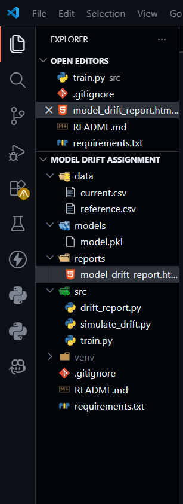
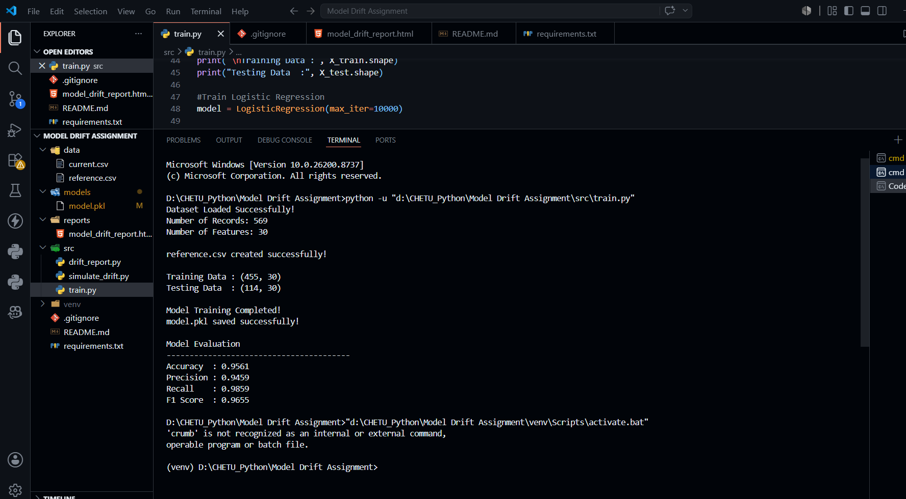
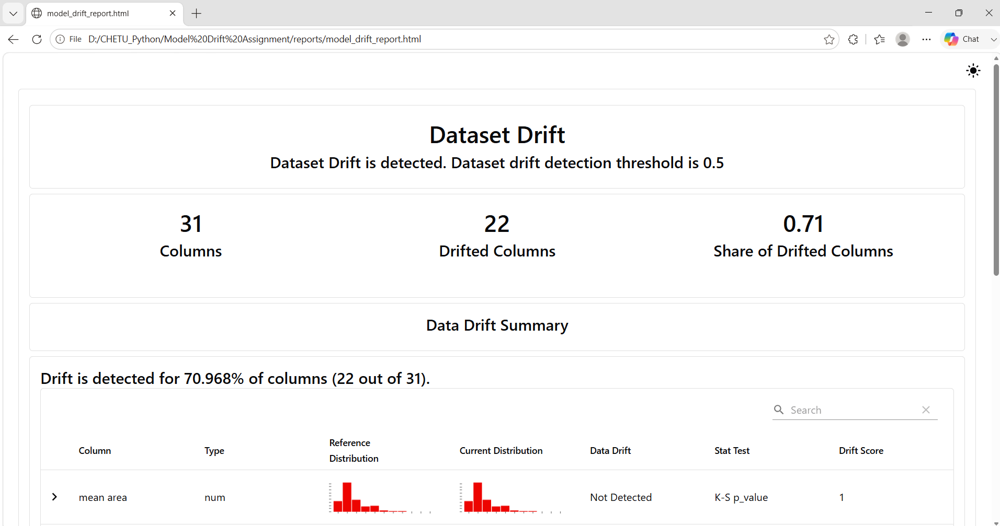
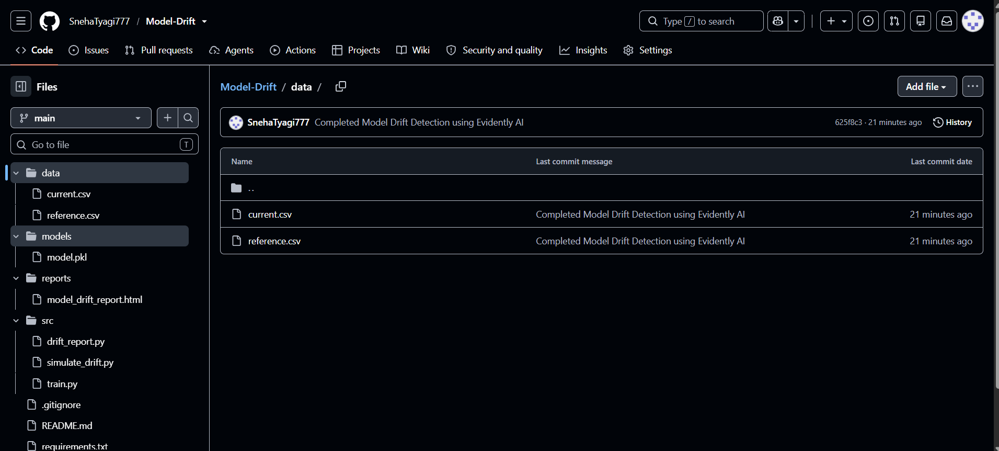

# Model Drift Detection using Evidently AI

## Project Overview

This project demonstrates how to detect data drift in a machine learning system using Evidently AI. A Logistic Regression model is trained using the Breast Cancer Wisconsin Dataset from the scikit-learn library. After training, a reference dataset is created and a production-like dataset is generated by introducing artificial drift through Gaussian noise, feature shifting, and label flipping. Evidently AI is then used to compare both datasets and generate an interactive HTML report to identify feature distribution changes and dataset drift.


## Project Objectives

- Train a Logistic Regression model on the Breast Cancer Wisconsin Dataset.
- Save the trained model using Pickle.
- Create a reference dataset for monitoring.
- Simulate production data drift.
- Detect data drift using Evidently AI.
- Generate an interactive HTML drift report.
- Organize the project using a professional GitHub structure.


## Features

- Logistic Regression model training
- Model serialization using Pickle
- Reference dataset generation
- Artificial drift simulation
- Feature drift detection using Evidently AI
- Interactive HTML drift report
- Model performance evaluation
- Professional GitHub project structure


## Dataset

**Dataset:** Breast Cancer Wisconsin Dataset

Loaded using:

```python
from sklearn.datasets import load_breast_cancer
```

### Dataset Information

- Total Records: **569**
- Total Features: **30**
- Target Classes:
  - **0 → Malignant**
  - **1 → Benign**


## Project Structure

```
Model-Drift/
│
├── data/
│   ├── reference.csv
│   └── current.csv
│
├── models/
│   └── model.pkl
│
├── reports/
│   └── model_drift_report.html
│
├── src/
│   ├── train.py
│   ├── simulate_drift.py
│   └── drift_report.py
│
├── README.md
├── requirements.txt
└── .gitignore
```


## Technologies Used

- Python
- Pandas
- NumPy
- Scikit-learn
- Evidently AI
- Matplotlib
- Pickle
- Git
- GitHub


## Installation

Clone the repository

```bash
git clone <repository_url>
```

Move into the project directory

```bash
cd Model-Drift
```

Create a virtual environment

```bash
python -m venv venv
```

Activate the virtual environment

### Windows

```bash
venv\Scripts\activate
```

Install the required libraries

```bash
pip install -r requirements.txt
```


## Project Execution

### Step 1: Train the Model

```bash
python src/train.py
```

This script:

- Loads the Breast Cancer dataset
- Trains a Logistic Regression model
- Saves the trained model as `model.pkl`
- Creates `reference.csv`
- Displays Accuracy, Precision, Recall and F1-score


### Step 2: Simulate Data Drift

```bash
python src/simulate_drift.py
```

This script:

- Loads the reference dataset
- Adds Gaussian Noise
- Shifts selected features
- Flips 10% target labels
- Saves the modified dataset as `current.csv`


### Step 3: Generate Drift Report

```bash
python src/drift_report.py
```

This script:

- Compares reference and current datasets
- Detects feature distribution changes
- Generates an interactive HTML report
- Saves the report inside the `reports` folder


## Project Workflow

```
Load Dataset
      │
      ▼
Train Logistic Regression Model
      │
      ▼
Save model.pkl
      │
      ▼
Create reference.csv
      │
      ▼
Simulate Data Drift
      │
      ▼
Generate current.csv
      │
      ▼
Compare Datasets using Evidently AI
      │
      ▼
Generate model_drift_report.html
```


## Outputs

The project generates the following outputs:

- Trained Machine Learning Model (`model.pkl`)
- Reference Dataset (`reference.csv`)
- Drifted Dataset (`current.csv`)
- Interactive Evidently AI Report (`model_drift_report.html`)
- Model Evaluation Metrics


## Model Evaluation Metrics

The Logistic Regression model is evaluated using:

- Accuracy
- Precision
- Recall
- F1-score


## Drift Simulation Techniques

The following techniques were used to simulate production data drift:

- Gaussian Noise
- Feature Value Shifting
- 10% Target Label Flipping


## Results

The Logistic Regression model achieved strong classification performance on the Breast Cancer Wisconsin Dataset. After introducing artificial drift into the production dataset, Evidently AI successfully detected feature distribution changes and generated an interactive HTML report highlighting drifted features. This demonstrates how data drift monitoring can help maintain the reliability of machine learning models in production environments.


## Screenshots
## Screenshots

The following screenshots demonstrate the successful implementation and execution of the project.

### 1. Project Structure

This screenshot shows the organized project folder structure in Visual Studio Code.




### 2. Model Training Output

This screenshot displays the successful execution of the model training script along with the evaluation metrics, including Accuracy, Precision, Recall, and F1-score.




### 3. Evidently AI Drift Report

This screenshot presents the interactive Evidently AI report highlighting dataset drift, feature drift statistics, distribution changes, and visual comparisons between the reference and current datasets.




### 4. GitHub Repository

This screenshot shows the final GitHub repository containing the complete project structure, source code, datasets, trained model, Evidently report, and project documentation.




## Key Learnings

Through this project, I learned:

- Machine Learning workflow
- Logistic Regression model training
- Dataset splitting
- Model serialization using Pickle
- Data drift concepts
- Drift simulation techniques
- Evidently AI for drift detection
- Git and GitHub project organization


## Future Improvements

- Compare Logistic Regression with Random Forest
- Perform real-time drift monitoring
- Deploy the project using Flask or FastAPI
- Automate scheduled drift detection
- Integrate cloud-based model monitoring


## Author

**Sneha Tyagi**


## License

This project was developed for educational and learning purposes.